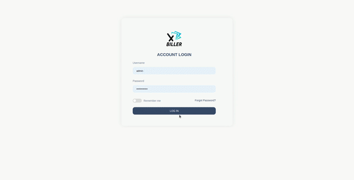
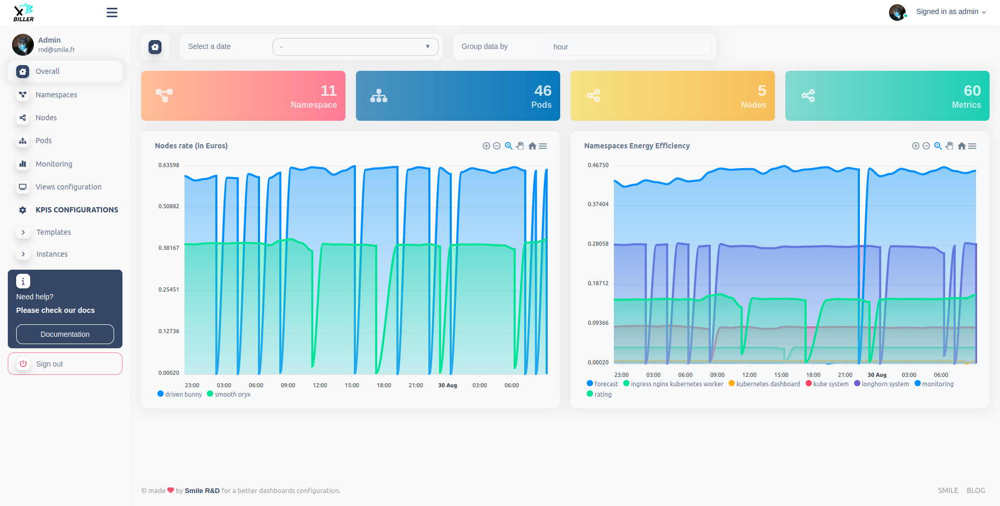
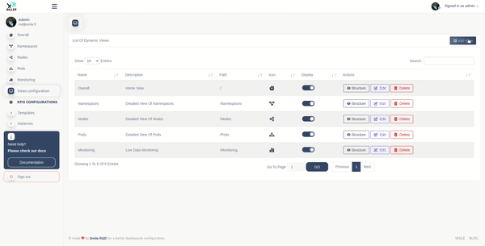
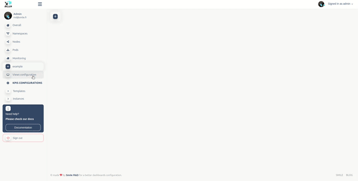
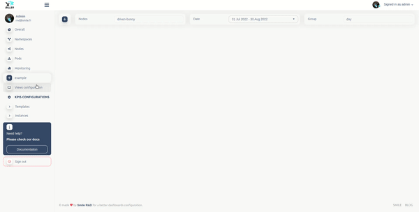
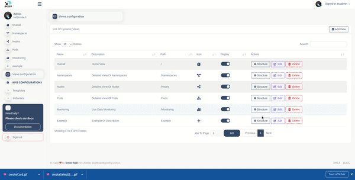

# X-BI

X-BI is a platform that allows access, interaction, and personalization of BI information for a better dashboard experience.



## Tech / Framework used

Project is created with:
> - Vue.js
> - JsonSchema
> - Storybook

## Getting Started

This project uses ```Vue.js``` to build user interfaces, ```yarn``` as the dependency manager, ```storybook``` for
component testing.
X-BI uses yarn commands. You can compare yarn and npm commands in the yarn docs.

#### 1. Install dependencies

Install X-BI using yarn, open your command prompt in the main directory of the cloned repository and run this command:
> yarn install

#### 2. Connect API to X-BI

To use X-BI, you will need an API. The API serves as a communication interface between the components. You need a data source to power X-BI. For the example, you can use
the [Rating Operator API](https://github.com/Smile-SA/rating-operator-api).
#### How to configure API information in X-BI?

Open ```src/uiConfiguration.js``` file, look for ```apiInfo``` properties. If you can't find it, create it and follow this example to configure the API details:

```
"APIInfo": {
    "url": "http://localhost:5012/",
    "login": "http://localhost:5012/login_user",
    "logout": "http://localhost:5012/login_user",
    "password": "http://localhost:5012/password",
    "redirectAfterLogin": "/",
    "redirectAfterLogout": "/login",
    "mode": "default"
  }
```

If you want to use rating operator API, you will need to change mode ```default``` to ```ro```

#### 3. Run X-BI

> Run the project using ```yarn serve```, the project will start on http://localhost:8080
>
>For component testing used ```yarn storybook```, the project will start on http://localhost:6006
>
>Alternatively, you can build the project in static directory for production : ```yarn build```

- #### Home page



- #### Monitoring Chart


#### 4. Configuration of dashboard

You can configure your own dashboard in two ways: via the user interface or through the configuration file.

#### 4.1 Via the configuration page

- ##### 4.1.1 Add a view

Go to ```views configuration``` page and follow this example to add your view



- ##### 4.1.2 View structure

A view is structured into three fields:
> - Select button
> - Cards
> - Charts

To configure the structure go to the View List in ```Views Configuration``` page. Click on the
```Structure``` button next to the view you want to configure. Once on the structure page, you will
see the view structures table and click on the top right button ``` Add ... ``` and fill the requested information.

- ##### 4.1.2.1 Add Select button



- ##### 4.1.2.2 Add Card



- ##### 4.1.2.3 Add Chart



- ##### 4.1.3 Edit view or structure

To edit an element, whether it is a view or its structure (selection, map, graphic), click on the edit button of the
element line to be edited, then edit the values that you want and save.

- ##### 4.1.4 Delete a view structure

To delete an element (view, selection button, card, or chart), click the Delete button next to it. Confirm or cancel the action when prompted.

##### Note : You may get errors if the value does not respect the checks defined in the configuration files.

#### 4.2 Via the configuration file

In the JSON configuration file you have the following properties:

> - ```apiInfo``` : API properties that enable authentication and other related configurations.
> - ```forms``` : In forms, there are multiple items, each containing form fields that correspond to the form schema of a Vue Formulate form.
> - ```views``` : In views, you have static fields (do not modify them if you do not understand the X-BI code) and dynamic fields.
    fields.
> - ```xBiInfo``` : In xBiInfo, you have X-BI-related information.

##### Prerequisites

> - Familiarity with [JSON syntax](https://jsonformatter.curiousconcept.com) is required.
> - Familiarity with [Vue Formulate](https://vueformulate.com).

- ##### 4.2.1 Forms configuration 

In `src/uiConfiguration.json`, navigate to the forms property. You will find sections such as `view`, `select`, `card`, and `chart`. Add or edit your own configuration as needed.

##### **Conditional fields configuration** :

First, add an item containing the `condition` property to the form:

``` 
 {
   "component": "FormulateInput",
   "type": "select",
   "name": "type",
   "placeholder": "Select type",
   "options": {
     "date": "Date",
     "dynamic": "Dynamic",
     "group": "Group"
   },
   "validation": "required",
   "condition": true
}
```

Second, add fields inside the conditionFields property. The conditionFields property must include:

> - `name`: The name of the field that the condition depends on. Here, it's type.
> - `values`: The values for the condition.
> - `validation`: Refer to the [Vue Formulate](https://vueformulate.com/) documentation to understand and fill in the validation values.

``` 
{
  "component": "FormulateInput",
  "type": "text",
  "name": "query",
  "placeholder": "Enter query link",
  "conditionFields": {
    "name": "type",
    "values": [
      "dynamic"
    ],
    "validation": "required|min:1,length"
  }
}, 
{
  "component": "FormulateInput",
  "type": "select",
  "name": "default_data",
  "placeholder": "Select default data",
  "options": {
    "hour": "hour",
    "day": "day",
    "month": "month",
    "year": "year"
  },
  "conditionFields": {
    "name": "type",
    "values": [
      "group"
    ],
    "validation": "required"
  }
} 
```

##### **Dynamic select options configuration** :

Just use the optionsData property and specify your API endpoint, which should return an array of options with their corresponding IDs, e.g.:

``` data: [{"name": "example1", "value":"value1},{"name": "example2", "value": "value2"}]```

```
{
 "component": "FormulateInput",
 "type": "select",
 "name": "template_name",
 "placeholder": "Select template name",
 "options": {},
 "optionsData": {
   "url": "http://localhost:5012/options",
   "id": "name"
 },
 "validation": "required"
}
  ```

- ##### 4.2.2 View structure configuration
    - ##### 4.2.2.1 Add a model

In the configuration file, adding a view model and its structure is done in dynamic views. Let's add a new model named
`Example1` and configure its structure.
In the JSON file go to ``` views > dynamics > ``` and add a new entry as follows:

```
{
  "views": {
    "dynamics": [
      {
        "name": "Example1",
        "path": "/",
        "icon": "fa-house-chimney-window",
        "description": "Description of example one",
        "display": true,
        "displayInMenu": true,
        "requiresAuth": true,
        "structure": {...}
      },
      ...
    ]
  }
}
```

To determine the expected variables in models, their importance, and their data types, go to the forms section and check the relevant properties (card, charts, views, or select).

- ##### 4.2.2.2 Delete model

To delete a model (select, chart, or card), remove its entry from the dynamic views structure.
Go to:
> - `views > dynamics > viewName > structure > select > models`
> - `views > dynamics > viewName > structure > chart > models`
> - `views > dynamics > viewName > structure > card > models`

and delete a field.

## Static data branch

We used a dedicated `static-data-demo` branch to provide demonstration functionality with pre-loaded static data. 

This branch is automatically deployed to GitHub Pages through our Gitlab CI/CD pipeline, making the demo instantly accessible online without requiring any data connections. 

## Demo Environment
You can explore X-BI by visiting the following [demo environment]( https://Smile-SA.github.io/X-Bi). To access the dashboard, use the following credentials:
  - Username: `admin`
  - Password: `secret`

## Contribute

Simply open a pull request in the repository to describe your changes.

## Credits

- Rnd Team @SMILE R&D,
- Koku Ulrich GBLOKPO @koku-ulrich.gblokpo,
- Jonathan Rivalan (author) @JonRiv.

## License

Licensed under the Apache 2.0 license.
