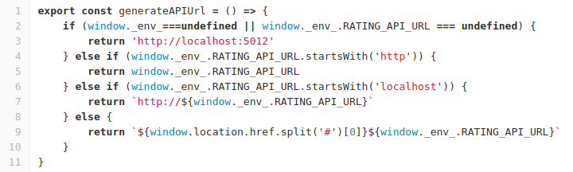

# X-BI
X-BI allows its users to access BI informations they can customise and interact with.


### Tech / Framework used
Project is created with:
```
 - Vue.js
 - Storybook
```

### Before installation X-BI install your API

    Api is used as the communication interface between the components, you need a data source to feed x-bi
    For the example you can use the rating-operator API, follow this link to install it : https://git.rnd.alterway.fr/overboard/5gbiller/rating-operator-api

Note: X-BI uses yarn commands, but npm will also work. You can compare yarn and npm commands in the yarn docs.

## Getting Started
### 1 - Access project file
There are three ways to access the project file on git :
```
- Clone with SSH (link : https://git@git.rnd.alterway.fr:overboard/5gbiller/rating-operator-api.git)
- Clone with HTTPS (link : https://git.rnd.alterway.fr/overboard/5gbiller/rating-operator-api.git)
- Or download on git (link : https://git.rnd.alterway.fr/overboard/5gbiller/rating-operator-api)
```

### 2 - Install dependencies
Install X-BI using yarn, open your command prompt from the main directory of the clone directory and write this command :
```
yarn install
```

### 3 - Connect API to X-BI
Open the file ```src/settings/variables.js```, in the function ```generateAPIUrl``` at line 3 you can set your api url,
by default you have a ```http://localhost:5012```.


### 4 - run X-BI
Run the project use yan :
``` 
yarn serve 
```
Alternatively, you can build the project in static directory for production :
``` 
yarn build 
```
## You just successfully run X-BI!
```
The project is launched by default on http://localhost:8080
```
### Home page


### Monitoring Page


### 5 - configuration of dashboard
You can configure your dashboard with the charts and cards you want. There are two types of configuration :
- On the configuration page
- In the configuration file

#### 5.1 On the configuration page
First you will select the view you want to configure. Then you will see the default configuration of cards and charts
 


You have option to add or remove a model of cards or charts

   #### 5.1.1 Add a card model
To add a new card model, you have to click the add card button on top of th card table


You will see the card form, follow the instructions, complete and save the form to add a new form


#### 5.1.2 Delete a card model
To delete a card model, you have to click the Delete button on the right of the card row


Then you will have a deletion confirmation form and the model will be deleted according to your choice


#### 5.2 On the configuration file : 

## Contribute
Simply open a pull request over the repository to describe your changes.
## Credits
- Rnd Team @ Alter Way
- Koku Ulrich GBLOKPO @koku-ulrich.gblokpo
- Jonathan Rivalan (author) @JonRiv

## License

Licensed under the Apache 2.0 license.