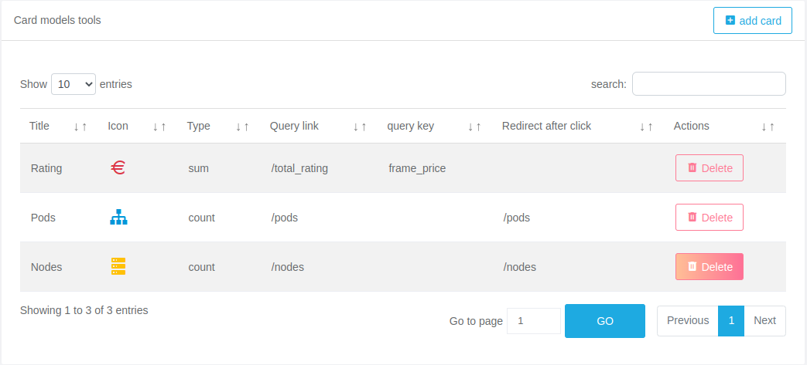

# X-BI
X-BI allows its users to access BI informations they can customise and interact with.


### Tech / Framework used
Project is created with:
```
 - Vue.js
 - ajv.js
 - Storybook
```

### Before installation X-BI install your API
```
    Api is used as the communication interface between the components, you need a data source to feed x-bi
    For the example you can use the rating-operator API, follow this link to install it : https://git.rnd.alterway.fr/overboard/5gbiller/rating-operator-api
```
Note: X-BI uses yarn commands, but npm will also work. You can compare yarn and npm commands in the yarn docs.

## Getting Started
### 1 - Access project file
There are three ways to access the project file on git :
```
- Clone with SSH (link : https://git@git.rnd.alterway.fr:overboard/5gbiller/rating-operator-api.git)
- Clone with HTTPS (link : https://git.rnd.alterway.fr/overboard/5gbiller/rating-operator-api.git)
- Or download on git (link : https://git.rnd.alterway.fr/overboard/5gbiller/rating-operator-api)
```

### 2 - Install dependencies
Install X-BI using yarn, open your command prompt from the main directory of the clone directory and write this command :
```
yarn install
```

### 3 - Connect API to X-BI
Open the file ```src/settings/variables.js```, in the function ```generateAPIUrl``` at line 3 you can set your api url,
by default you have a ```http://localhost:5012```.
```
export const generateAPIUrl = () => {
    if (window._env_===undefined || window._env_.RATING_API_URL === undefined) {
        return 'http://localhost:5012'
    } else if (window._env_.RATING_API_URL.startsWith('http')) {
        return window._env_.RATING_API_URL
    } else if (window._env_.RATING_API_URL.startsWith('localhost')) {
        return `http://${window._env_.RATING_API_URL}`
    } else {
        return `${window.location.href.split('#')[0]}${window._env_.RATING_API_URL}`
    }
}
```

### 4 - run X-BI
Run the project use yan :
``` 
yarn serve 
```
Alternatively, you can build the project in static directory for production :
``` 
yarn build 
```
## You just successfully run X-BI!
```
The project is launched by default on http://localhost:8080
```
### Home page

### Monitoring Page

### 5 - configuration of dashboard
You can configure your dashboard with the charts and cards you want. There are two types of configuration :
- On the configuration page
- In the configuration file

#### 5.1 On the configuration page
First you will select the view you want to configure. Then you will see the default configuration of cards and charts.


You have option to add or remove a model of cards or charts.

#### 5.1.1 Add a model
Example : To add a new card model, you have to click the add card button on top of th card table.


You will see the card form, follow the instructions, complete and save the form to add a new form.


#### 5.1.2 Delete a model
Example : To delete a card model, you have to click the Delete button on the right of the card row.



Then you will have a deletion confirmation form and the model will be deleted according to your choice.


#### 5.2 In the configuration file
##### Prerequisites
``` 
- Know the syntax of json schema : https://ajv.js.org/
- Know the schema form for vue-form-generator : https://github.com/vue-generators/vue-form-generator
```

In the configuration json file you have a views and controls, in the controls you have controls options views and cards and in each you have the schema which corresponds to the ajv.js schema and form which corresponds to the form generator of vue-form-generator.
``` 
{
  "views": {
    "Overall": {
      "title": "Overall",
      "type": "admin",
      "structure":{
        "card":{...},
        "chart":{...}
      }
    },
    "Namespaces":{...}
  },
  "controls": {
    "chart": {
      "schema":{...},
      "form":{...}
    },
    "card": {
      "schema":{...},
      "form":{...}
    }
  }
}
```
#### 5.2.1 Add a model
In the configuration files the addition of a model is done in the structure of the views.

Example: let's add a model to the chart in the namespaces view.

In Json file Go To ``` views > namespaces > structure > chart > models ``` add a new element in the models respecting the properties and the expected values.
```
{
  "views": {
    "Overall": {...},
    "Namespaces": {
      "title": "Namespaces",
      "type": "admin",
      "structure":{
        "card": {...},
        "chart": {
          "models": [
            {
              "type": "area",
              "title": "Metrics rate (in Euros)",
              "query": "/rating",
              "sort_id": "metric",
              "time_id": "frame_begin",
              "value_id": "frame_price",
              "axis_type": "datetime",
              "is_monitoring": "false"
            },
            {
              "type": "area",
              "title": "The example ",
              "query": "/example_link",
              "sort_id": "example_metric",
              "time_id": "example_frame_begin",
              "value_id": "example_frame_price",
              "axis_type": "datetime",
              "is_monitoring": "true"
            }
          ],
          "styles": {
            "height": "400",
            "font_size": "20px"
          }
        }
      }
    }
  },
  "controls": {...}
}
```
To know the expected variables in the models, their importance and their data types ...
You have to go to the controls and depending on the models either card or charts you will look in the data of the schema.

Example : 
```
{
  "views": {...},
  "controls": {
    "chart": {
      "schema": {
        "type": "object",
        "properties": {
          "type": {
            "type": "string",
            "enum": [
              "area",
              "bar",
              "bubble",
              "candlestick",
              "donut",
              "heatmap",
              "histogram",
              "line",
              "pie",
              "radar",
              "radialBar",
              "scatter"
            ]
          },
          "title": {
            "type": "string"
          },
          "query": {...},
          "sort_id":{...},
          "time_id": {...},
          "value_id": {...},
          "axis_type": {...},
          "is_monitoring": true
        },
        "required": [
          "type",
          "title",
          "query",
          "sort_id",
          "time_id",
          "value_id",
          "axis_type",
          "is_monitoring"
        ],
        "additionalProperties": false
      },
      "form": {...}
    },
    "card": {...}
  }
}
```

#### 5.2.2 Delete model
To delete a model of chart or card, simply delete a field from its models.

Go to ``` views > namespaces > structure > chart > models ``` or ``` views > namespaces > structure > card > models ``` and delete one field.

## Contribute
Simply open a pull request over the repository to describe your changes.

## Credits
- Rnd Team @ Alter Way,
- Koku Ulrich GBLOKPO @koku-ulrich.gblokpo,
- Jonathan Rivalan (author) @JonRiv.

## License
Licensed under the Apache 2.0 license.