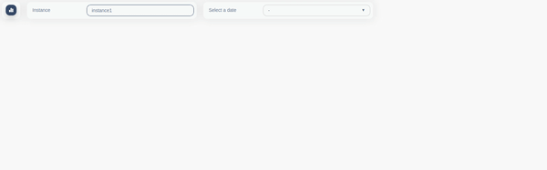

# X-BI
X-BI allows its users to access BI informations they can customise and interact with.


### Tech / Framework used
Project is created with:
 > - Vue.js
 > - ajv.js
 > - JsonSchema
 > - Storybook

### Before installation X-BI install your API
Api is used as the communication interface between the components, you need a data source to feed x-bi. For the example you can use the rating-operator API, follow this link to install it.

>https://git.rnd.alterway.fr/overboard/5gbiller/rating-operator-api

### Note:
X-BI uses yarn commands, but npm will also work. You can compare yarn and npm commands in the yarn docs.

## Getting Started
### 1 - Access project file
There are three ways to access the project file on git :

> - Clone with SSH (link : https://git@git.rnd.alterway.fr:overboard/5gbiller/rating-operator-api.git)
> - Clone with HTTPS (link : https://git.rnd.alterway.fr/overboard/5gbiller/rating-operator-api.git)
> - Or download on git (link : https://git.rnd.alterway.fr/overboard/5gbiller/rating-operator-api)

### 2 - Install dependencies
Install X-BI using yarn, open your command prompt from the main directory of the clone directory and write this command:
>yarn install

### 3 - Connect API to X-BI
Open the file ```src/settings/variables.js```, in the function ```generateAPIUrl``` at line 3 you can set your api url,
by default you have a ```http://localhost:5012```.
```
export const generateAPIUrl = () => {
    if (window._env_===undefined || window._env_.RATING_API_URL === undefined) {
        return 'http://localhost:5012'
    } else if (window._env_.RATING_API_URL.startsWith('http')) {
        return window._env_.RATING_API_URL
    } else if (window._env_.RATING_API_URL.startsWith('localhost')) {
        return `http://${window._env_.RATING_API_URL}`
    } else {
        return `${window.location.href.split('#')[0]}${window._env_.RATING_API_URL}`
    }
}
```

### 4 - run X-BI
Run the project use yan :
>yarn serve

Alternatively, you can build the project in static directory for production :
>yarn build 

#### You just successfully run X-BI!
The project is launched by default on http://localhost:8080

- #### Home page


- #### Monitoring Page


### 5 - configuration of dashboard
The configuration of your own dashboard is possible. There are two types of configuration :
- On the configuration page 
- In the configuration file

- #### 5.1 On the configuration page
  - ##### 5.1.1 Add a view
    Once on the configuration page, you will click on the Add view button, you will have a view addition form which will open on the screen then you will fill in the requested information, then you save the form.
    <br/><br/>
    

  - ##### 5.1.2 Add a view structure
      A view is structured in three elements:
      - Select button
      - Cards
      - Charts

      To configure the structure of a view you will click on the structure button on the line of sight you want to configure.
      Once on the structure page, you will see the table of view structure elements and click on the top right button ``` Add(name of strucutre element) ``` on the table of elements you want to add and save the requested information.
      - ###### 5.1.2.1 Add Select button
  
      

      - ###### 5.1.2.1 Add Card
      

      - ###### 5.1.2.1 Add Chart
      
  
  - ##### 5.1.2 Edit a view structure
  To modify an element whether it is a view or the structure of the element of a view, you will click on the update button and then modify the values that you want to modify.
You may get errors on the screen if the value does not respect the checks defined in the configuration controls.

  - ##### 5.1.2 delete a view structure
  You may get errors on the screen if the value does not respect the checks defined in the configuration files.

#### 5.2 In the configuration file
##### Prerequisites
> Know json syntax
> Know json schema syntax  : https://ajv.js.org/
> Know vue-form-generator schema form : https://github.com/vue-generators/vue-form-generator

In the configuration json file you have :
  - views  
  - and controls

  - ##### 5.2.1 Configuration controls
    In controls, you have 4 items
    - view 
    - select
    - card
    - chart
  
    In each you have the ```schema``` which corresponds to the ajv.js schema and form which corresponds to the ```form``` generator of vue-form-generator.
    
``` 
{
  "views": {...},
  "controls": {
    "view": {
      "schema":{
        "type": "object",
        "properties": {
          "name": {
            "type": "string",
            "minLength": 1
          },
          "display": {
            "type": "boolean"
          }
        }
      },
      "form":{
        "form": {
          "fields": [
            {
              "model": "title",
              "type": "input",
              "inputType": "text",
              "required": true,
              "placeholder": "Title"
            },
          ]
        }
      }
    },
    "select": {...},
    "chart": {...},
    "card": {...}
  }
}
```
In the ```schema``` you can define the id of your fields, the type, the size... of your configuration elements.
In the ```form``` fields, for each schema field, you will first bind the schema name to the form element model, then you can define if the element is a simple input, a switch, a select, the possible values, the name, the text of the placeholder ....

  - ##### 5.2.2 Configuration view structure

    - ##### 5.2.2.1 Add a model

In configuration files, adding a view model and its structure is done in dynamic views.

Example: Let's add a new model named example1 and configure its structure.
In Json file Go To ``` views > dynamics > ``` add a new element in the items respecting the properties and the expected values.

```
{
  "views": {
    "default": {...},
    "statics": [...],
    "dynamics": [
      {
        "name": "Example1",
        "path": "/",
        "icon": "fa-house-chimney-window",
        "description": "Description of example one",
        "display": true,
        "displayInMenu": true,
        "requiresAuth": true,
        "structure": {...}
      },
      {"name": "Overall"...},
      {"name": "Namespaces"...}
    ]
  },
  "controls": {
    "view": {...},
    "select": {...},
    "card": {...},
    "chart": {...}
  }
}
```
To know the expected variables in the models, their importance and their data types ...
You have to go to the controls and depending on the models either card charts views or select you will look in the data of the schema.

  - ##### 5.2.2.2 Delete model
To delete a model of chart or card, simply delete a field from its models.

Go to ``` views > namespaces > structure > chart > models ``` or ``` views > namespaces > structure > card > models ``` and delete one field.

## Contribute
Simply open a pull request over the repository to describe your changes.

## Credits
- Rnd Team @ Alter Way,
- Koku Ulrich GBLOKPO @koku-ulrich.gblokpo,
- Jonathan Rivalan (author) @JonRiv.

## License
Licensed under the Apache 2.0 license.